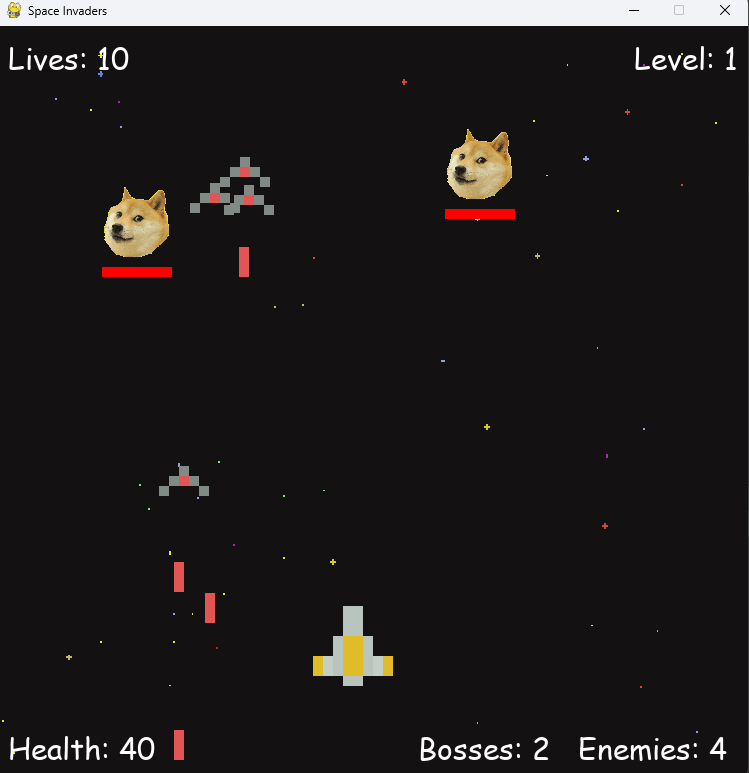

# 
 Systemy Operacyjne 2 - Projekt 

 Prowadzący: mgr inż. Tomasz Szandała 
  

 Autorzy:
 

 Bartosz Radtke 259058 
  

 Maciej Demucha 
   

<h2> Opis Projektu</h2>

Naszym zadaniem było stworzenie aplikacji "Space Invaders" w języku Python działającej na wielu wątkach.
  

W grze celem jest pokonanie mini-bossów i statków przeciwników na każdym poziomie. Statki przeciwników ostrzeliwują gracza, a ich liczba zwiększa się wraz z postępem gry. Mini-bossy nie strzelają, ale pozostają na ekranie do momentu ich pokonania. Przy każdym poziomie odbijają się od krawędzi ekranu i ich liczba jest stała.

 <h2>Użyte technologie </h2>

Projek został wykonany w języku Python w głównej mierze za pomocą bibliotek `threading` oraz `PyGame`. Użyte biblioteki
pomocnicze to `os` oraz `random`.

 <h2> Budowa programu </h2> 

W grze mamy pięć głównych klas - `ship`, `player`, `enemy`, `boss` i `laser`. Klasa `Ship` stanowi bazę dla statków,
czyli zarówno
dla gracza (`player`), jak i dla przeciwników (`enemy` i `boss`). Odpowiada ona za rysowanie statku na ekranie oraz
strzelanie. W klasie `player` dodatkowo zaimplementowano funkcje poruszania, sprawdzania kolizji z przeciwnikami,
obsługę
życia i ruchu. W klasie `enemy` dodano funkcję strzelania z określonym prawdopodobieństwem, aby przeciwnik nie mógł
strzelać ciągle.
Mini-bossy mają paski życia, są rysowane na oddzielnych przeźroczystych warstwach, odbijają się od ekranu i używają
funkcji run do rozpoczęcia działania na wątku. Klasa laser odpowiada za strzelanie do przeciwników.
W funkcji main tworzone są wszystkie statki i zdefiniowane jest zachowanie gry.

 <h2> Implementacja wielowątkowości oraz mutexów</h2> 

Klasa `boss` korzysta z modułu `threading` i jej działanie odbywa się na osobnym wątku.
Aby zapewnić poprawne działanie bossów, dodano mutexy w klasie `boss` przy rysowaniu, oraz w pliku main.py.
W pliku `main.py` użyte są mutexy (w tym przypadku funkcja `threading.Lock()`) w celu synchronizacji dostępu do pewnych
sekcji kodu, które są współbieżnie wykonywane przez wątki. W szczególności, mutexy są używane w trzech miejscach:

- Blokowanie dostępu do sekcji kodu, która aktualizuje stan i rysuje obiekty typu `Boss` na ich warstwach (layers).
  Wielowątkowość jest wykorzystywana do poruszania bossami niezależnie od reszty gry. Aby uniknąć konfliktów, mutex jest
  stosowany wokół operacji rysowania (draw) i aktualizowania paska zdrowia (healthbar) bossa. Mutex zapewnia, że tylko
  jeden wątek może modyfikować warstwę i jej zawartość w danym czasie, eliminując tym samym problem współbieżnego
  dostępu do tych danych.  

- Blokowanie dostępu do listy bossów i ich warstw w momencie, gdy gracz przegrywa. W momencie, gdy gracz przegrywa,
  wątek główny gry próbuje zatrzymać i usunąć wszystkich bossów oraz warstwy z gry. Mutex jest używany, aby uniknąć
  konfliktów dostępu do tych danych przez inne wątki, takie jak wątek odpowiedzialny za ruch bossów. Po zablokowaniu
  mutexu, ustawiana jest flaga `health` na 0 dla każdego bossa, co powoduje zakończenie ich wątków. Następnie mutex jest
  zwalniany, pozwalając innym wątkom na dostęp do tych danych.  

- Mutex jest stosowany w pętli for boss in bosses: w bloku kodu, który sprawdza, czy gracz nie zostal 'ugryziony' przez naszego bossa.
Jest on zostosowany w tej sytuacji, aby tylko jeden wątek miał dostęp do bieżacych lokacji bossów, aby podczas sprawdzania wspomnianego warunku lokalizacja któregoś z bossów nie została zmieniona przez współbieżny wątek.
zachowania gry.

Mutexy są używane w tym przypadku w celu zapewnienia bezpiecznej i spójnej manipulacji danymi w środowisku
wielowątkowym. Chronią one współdzielone zasoby przed równoczesnym dostępem i zmianą przez wiele wątków, eliminując tym
samym ryzyko wystąpienia niezdefiniowanego zachowania i konfliktów.

  

